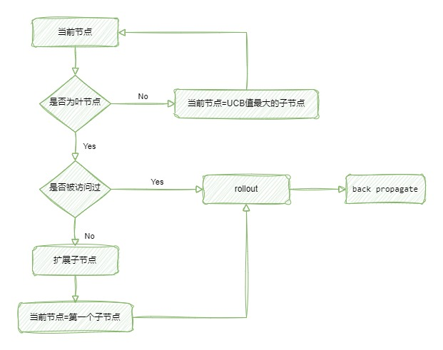

# Gomoku

基于蒙特卡洛树搜索的五子棋人机对战游戏。

## 蒙特卡洛树搜索

## UCB公式

原UCB公式为：

其中为该节点的价值，为该节点的访问次数，为该节点的父节点的访问次数。

本项目使用如下公式：

最初取2，但是对代码进行优化后，发现速度依旧不够快，所以决定从公式下手，减少"探索未知"的次数，将调整为4。

## 扩展子节点

首先获取相邻位置上有棋子的空位，然后根据该空位4个方向上敌我方棋子分布情况，评估该空位的价值。取价值前10的空位进行扩展。

为了减少搜索树的大小、加快速度、提高准确率，当对方出现"4子"时，只扩展可堵住对方"4子"的空位以及可让我方形成"5子"的空位。对于对方的"活3"，将要形成的"活3死4"、"双活三"也做了类似处理。当我方将要形成"活3死4"、"双活三"等杀棋时，只扩展相应的空位。

事实上，我们落子的位点的相邻位置上并不一定有棋子，有时候会隔一格。为兼顾速度和准确率，本项目采取如下策略：在双方共下8手棋后，开始对根节点和根节点的子节点进行一次补充扩展。补充扩展方法：获取相邻位置上有棋子的空位，以及隔一格有棋子的空位，按前述方法获取10个位点，补充扩展初次未扩展的子节点。

## Rollout

为了尽可能地`rollout`的准确率，不进行随机落子，而是对空位的价值进行`softmax`运算，根据概率进行落子。

为加快速度，每次`rollout`，双方共下至多20手棋，未分出胜负视为平局。

